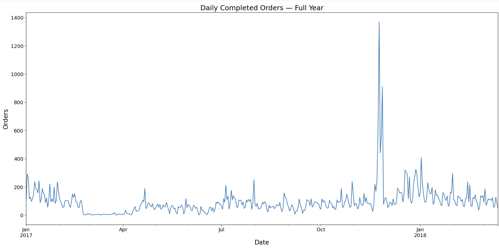
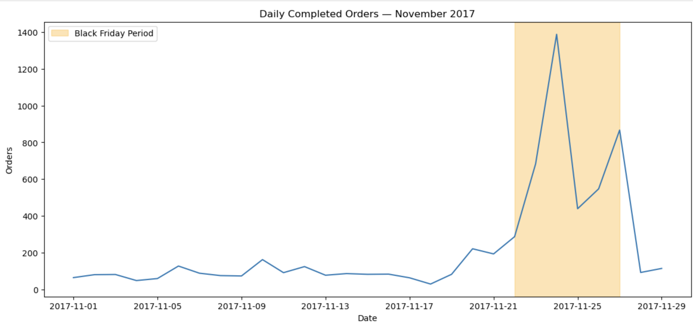
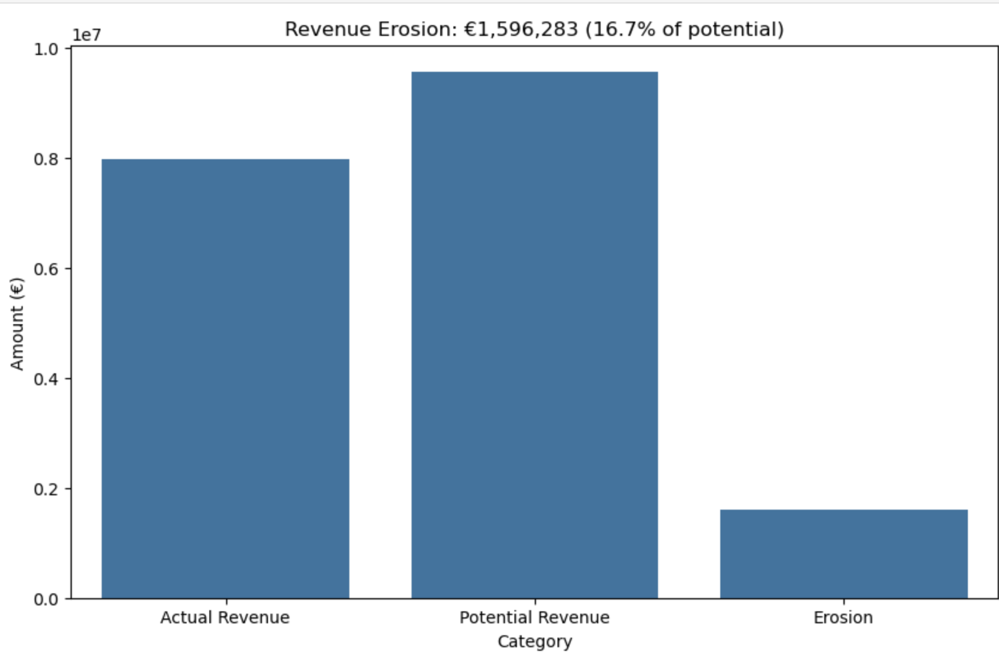
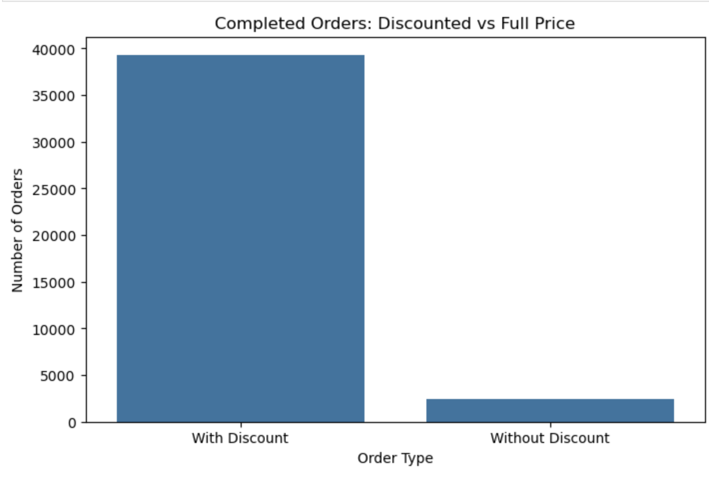
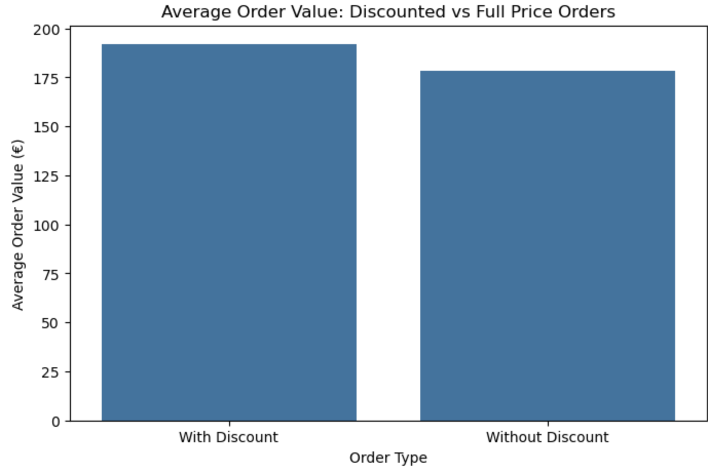

# Eniac Discount Strategy Analysis

**Python | pandas | seaborn | Jupyter Notebook**

---

## Project Overview

Eniac is an e-commerce company specializing in Apple-compatible tech products.
The company faced an internal strategic debate:

- **Marketing Team:** Discounts drive customer acquisition, satisfaction, and long-term growth
- **Board of Directors:** Aggressive discounting is eroding revenue despite order growth

As data analyst, I was tasked with providing clarity using transaction data —
with the added challenge that the dataset arrived corrupted and required
significant cleaning before analysis could begin.

---

## Dataset

- 226,909 orders (January 2017 – March 2018)
- 293,983 order lines
- 9,992 products across multiple categories
- 187 brands

**After cleaning:** 41,701 valid completed orders used for analysis

---

## Project Approach

This project had two distinct phases:

**Phase 1 — Learning & Exploration:**
Received four raw, uncleaned datasets and worked through data quality issues
from scratch. This included corrupted price values, wrong data types, duplicate
rows, missing values, and inconsistent formats. The purpose was to understand
the data deeply and practice real-world cleaning techniques.

**Phase 2 — Analysis:**
Received quality-controlled versions of the same four datasets, ensuring the
entire team worked from identical data. All key findings and visualizations
in this project are based on the cleaned dataset.

---

## Key Findings

### Discount Dependency
- **96% of completed orders** include at least one discounted product
- Only 4% of customers pay full price
- Discount penetration is consistent year-round — not just seasonal

### Revenue Erosion
- **Actual revenue:** €13.9M
- **Potential revenue at full price:** €16.2M
- **Discount erosion:** €2.3M (14.1% of potential revenue)

### The Paradox
Discounted orders have a **28% higher average order value** (€328.59 vs €249.99),
suggesting discounts encourage larger purchases.
However, the margin loss exceeds this volume benefit.

### Seasonality
- Black Friday drove a **7.6x increase** in daily orders (137 → 1,037 average)
- Peak single day: 2,367 orders on November 24, 2017
- Holiday period (Nov–Jan) accounts for approximately 39% of annual orders
- Outside this window, sales remain relatively flat year-round

### Conclusion
Both sides of the debate are valid. Discounts clearly work for volume and basket size.
But with 96% penetration and €2.3M in foregone revenue, discounting has become
the default business model rather than a strategic tool.
The missing piece: without customer tracking data, it is impossible to determine
whether discount-acquired customers return at full price.

---

## Data Quality Challenges

This project involved significant data cleaning before analysis was possible.

**Key issues resolved:**
- 12.3% of orderlines had corrupted prices (e.g. "1.137.99") — entire affected orders removed
- 2.23% of products had corrupted price values — flagged and excluded
- 8,746 duplicate product rows — removed
- 524 zero-price completed orders — excluded from profitability calculations
- Missing values and type conversion issues across multiple columns

See [docs/data_quality_notes.md](docs/data_quality_notes.md) for full methodology.

---

## Analysis Structure

### Phase 1: Data Exploration
- Assessed all four tables: orders, orderlines, products, brands
- Identified data types, missing values, duplicates, and range outliers
- Documented relationships between tables

### Phase 2: Data Cleaning
- Resolved corrupted price values using regex
- Filtered to completed orders only
- Removed orders with unknown products
- Converted date columns to datetime

### Phase 3: Discount Analysis
- Calculated revenue erosion (actual vs potential revenue)
- Identified orders with and without discounts at order level
- Compared average order values between discounted and full-price orders
- Analyzed Black Friday and holiday season impact

---

## Visualizations

**Full Year Order Volume**

**Black Friday Detail — November 2017**

**Revenue Erosion**

**Orders: Discounted vs Full Price**

**Average Order Value Comparison**

---

## Technical Challenges Solved

### Challenge: Wrong Aggregation for Margin Percentage
**Problem:** Using `AVG(margin_percentage)` in Looker Studio gave 43.55% instead of the correct 42.2%.
**Root cause:** Averaging percentages weights a €10 order equally with a €10,000 order.
**Solution:** Calculated as `SUM(margin) / SUM(revenue)` which correctly weights by transaction size.

---

## Tools

| Tool | Purpose |
|------|---------|
| Python | Primary language |
| pandas | Data manipulation, cleaning, aggregation |
| seaborn | Statistical visualizations |
| matplotlib | Chart customization and export |
| Jupyter Notebook | Interactive analysis environment |

---

## Strategic Recommendations

1. **Implement customer tracking** — Without lifetime value data, the true ROI of discounts cannot be measured
2. **Move toward selective discounting** — Reserve promotions for specific customer segments or acquisition periods rather than applying universally
3. **Protect peak season margins** — Holiday period (Nov–Jan) drives 39% of orders; customers in this window may purchase at full price without discounts

---

## About

Completed as part of a Data Analytics Weiterbildung.

This was a team project with a 3-person group. My contributions covered
the discount analysis, revenue erosion calculations, seasonality analysis,
and the final presentation. The team shared a common cleaned dataset to
ensure consistent results across all analyses.

Demonstrates data cleaning, exploratory analysis, business problem framing,
and stakeholder communication using Python.

**Armin Schnichels**
arminschnichels@gmail.com | [LinkedIn Profile]
